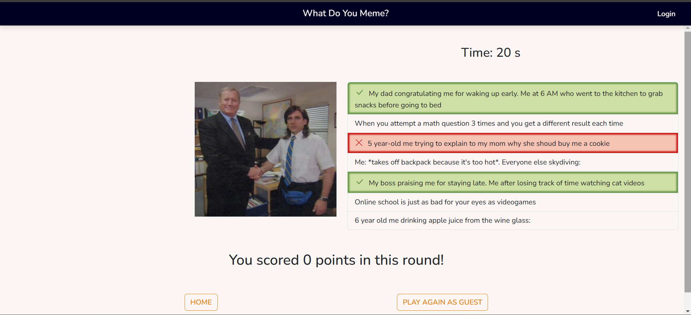
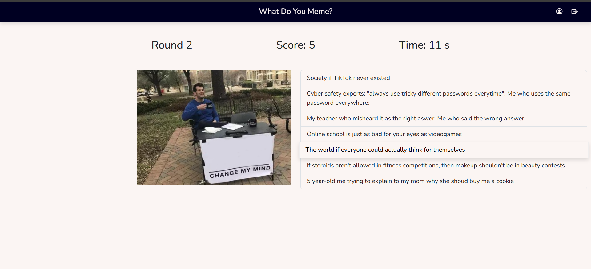

[](https://classroom.github.com/a/J0Dv0VMM)
# Exam #1: "Gioco dei Meme"
## Student: s331578 SILVESTRE GIORGIO 

## React Client Application Routes

- Route `/`: Contains the home page of the application, it's what the user first sees when they open the application
- Route `/game`: Contains the game page, where the user can play the game. If the user is logged in, it contains the game recap, besides the three rounds displayed one by one.
- Route `/user/history`: Contains the logged in user's games history. Shows all the games that the user has played, with the image and score per round per game.
- Route `/login`: Contains the login page, where the user can log in.
- Route `/*`: It's the route matched if the user didn't match any of the routes above, redirects to the home page.


## API Server


### Login

- HTTP method: `POST`
- URL: `/api/sessions`
- Description: Login a user.
- Request body: User credentials.

``` JSON
{
    "username": "username",
    "password": "password"
}
```

- Request parameters: _None_
- Response: `200 OK` (success)
- Response body: The user's credentials.

``` JSON
{
    "userID": 1,
    "username": "username"
}
```

- Error responses:  `401 Invalid username and/or password.`, `422 The parameters are not formatted properly`


### Logout

- HTTP method: `DELETE`
- URL: `/api/sessions/current`
- Description: Logout a user.
- Request body: _None_
- Request parameters: _None_
- Response: `200 OK` (success)
- Response body: _None_
- Error responses:  `503 Service Unavailable`, `401 Not authorized`


### Get logged in user's info

- HTTP method: `GET`
- URL: `/api/sessions/current`
- Description: Get logged in user's info.
- Request body: _None_
- Request parameters: _None_
- Response: `200 OK` (success)
- Response body: The user's credentials.

``` JSON
{
    "userID": 1,
    "username": "username"
}
```

- Error responses:  `401 Not authorized`


### Start a game

- HTTP method: `GET`  
- URL: `/api/game/start/:roundsAmount`
- Description: Get all the information needed by the client to start a new game, of `roundsAmount` rounds.
- Request body: _None_
- Request parameters: _roundsAmount_ number of rounds requested for that game: 3 if the user is logged in, 1 otherwise
- Response: `200 OK` (success)
- Response body: An object representing the new game, with pairs of keys and values, where the first pair represents the id of that game, and the value of the following pair is an array where each element represents a round.

``` JSON
{
    "gameID": 1,
    "rounds": [
        {
            "memeID": 1,
            "image": "path/to/image1.jpg",
            "random_captions": [
                {"captionID": 1, "caption": "caption1"},
                {"captionID": 2, "caption": "caption2"},
                {"captionID": 3, "caption": "caption3"},
                {"captionID": 4, "caption": "caption4"},
                {"captionID": 5, "caption": "caption5"},
                {"captionID": 6, "caption": "caption6"},
                {"captionID": 7, "caption": "caption7"}
            ]
        },
        {
            "memeID": 2,
            "image": "path/to/image2.jpg",
            "random_captions": [
                {"captionID": 1, "caption": "caption1"},
                {"captionID": 2, "caption": "caption2"},
                {"captionID": 3, "caption": "caption3"},
                {"captionID": 4, "caption": "caption4"},
                {"captionID": 5, "caption": "caption5"},
                {"captionID": 6, "caption": "caption6"},
                {"captionID": 7, "caption": "caption7"}
            ]
        },
        {
            "memeID": 3,
            "image": "path/to/image3.jpg",
            "random_captions": [
                {"captionID": 1, "caption": "caption1"},
                {"captionID": 2, "caption": "caption2"},
                {"captionID": 3, "caption": "caption3"},
                {"captionID": 4, "caption": "caption4"},
                {"captionID": 5, "caption": "caption5"},
                {"captionID": 6, "caption": "caption6"},
                {"captionID": 7, "caption": "caption7"}
            ]
        }
    ]
}
```

- Error responses:  `500 Internal Server Error`, `422 The parameters are not formatted properly`


### Check if the user has selected a correct caption

- HTTP method: `GET`
- URL: `/api/game/check/:captionID/:memeID`
- Description: Check if the user has selected a correct caption, given by `captionID`, for the meme of that round, given by `memeID`.
- Request body: _None_
- Request parameters: _captionID_ id of the caption selected by the user, _memeID_ id of the meme of that round
- Response: `200 OK` (success)
- Response body: An object containing a boolean value, indicating if the user has selected a correct caption. The object contains also an array representing the correct captions if the user has selected a wrong caption, or an empty array if the user has selected a correct caption:

``` JSON
{
    "correct": false,
    "correct_captions": [1, 2]
}
```

- Error responses:  `500 Internal Server Error`, `422 The parameters are not formatted properly`


### Get correct captions of a given meme

- HTTP method: `GET`
- URL: `/api/game/captions/:memeID`
- Description: Get correct captions of a given meme
- Request body: _None_
- Request parameters: _memeID_ id of the meme
- Response: `200 OK` (success)
- Response body: An array representing the correct captions of the given meme:

``` JSON
[1, 2]
```

- Error responses:  `500 Internal Server Error`, `422 The parameters are not formatted properly`


### Save the logged in user's game into the database

- HTTP method: `POST`
- URL: `/api/game/results`
- Description: Save the logged in user's game into the database, by writing into the `games` and `rounds` tables.
- Request body: An object containing the gameID, the total score for that game, and an array of the rounds in that game. Each round contains the memeID and the score for that round.

``` JSON
{
    "gameID": 1,
    "score": 10,
    "gameOutcome": [
        {
            "memeID": 1,
            "roundScore": 5
        },
        {
            "memeID": 2,
            "roundScore": 5
        },
        {
            "memeID": 3,
            "roundScore": 0
        }
    ]
}
```

- Request parameters:  _None_
- Response: `200 OK` (success)
- Response body: _None_
- Error responses:  `500 Internal Server Error`, `422 The parameters are not formatted properly`, `401 Not authorized`


### Get logged in user's games history

- HTTP method: `GET`
- URL: `/api/user/history`
- Description: Get logged in user's games history
- Request body: _None_
- Request parameters: _None_
- Response: `200 OK` (success)
- Response body: An array in which each element represents a game played by the currently logged in user. Each element contains the gameID, the total score for that game, and an array of the rounds in that game. Each round contains the memeID, the image path, and the score for that round.

``` JSON
[
    {
        "gameID": 1,
        "total_score": 0,
        "rounds": [
            {
                "memeID": 1,
                "image": "path/to/image1.jpg",
                "score": 0
            },
            {
                "memeID": 2,
                "image": "path/to/image2.jpg",
                "score": 0
            },
            {
                "memeID": 3,
                "image": "path/to/image3.jpg",
                "score": 0
            }
        ]
    }, 
    {
        "gameID": 2,
        "total_score": 10,
        "rounds": [
            {
                "memeID": 1,
                "image": "path/to/image1.jpg",
                "score": 5
            },
            {
                "memeID": 2,
                "image": "path/to/image2.jpg",
                "score": 0
            },
            {
                "memeID": 3,
                "image": "path/to/image3.jpg",
                "score": 5
            }
        ]
    }
]
```

- Error responses:  `500 Internal Server Error`, `401 Not authorized`


## Database Tables

- Table `captions` - contains `captionID` and `caption`
- Table `games` - contains `gameID`, `userID` and `total_score`
- Table `matches` - contains `memeID` and `captionID`
- Table `memes` - contains `memeID` and `image`
- Table `rounds` - contains `roundID`, `gameID`, `memeID` and `score`
- Table `users` - contains `userID`, `username`, `hash` and `salt`


## Main React Components

- `BaseLayout` (in `BaseLayout.jsx`): It's the container for all the other components in the application, using nested components that will be rendered in place of the `Outlet` component.
- `NavHeader` (in `NavHeader.jsx`): It contains all the components to render the header of the application.
- `LoginForm` (in `LoginForm.jsx`): It contains all the components to render the login page, where the user inputs their username and password.
- `HomeLayout` (in `HomeLayout.jsx`): It contains all the components to render the home page, where the user can start a game as guest or log in.
- `GameLayout` (in `GameLayout.jsx`): It contains all the components rendered during a game, displaying all the `RoundLayout` and the game recap if the user is logged in.
- `RoundLayout` (in `RoundLayout.jsx`): It contains all the components to render a round, displaying the meme image, the possible captions, and the `TimerLayout`.
- `TimerLayout` (in `TimerLayout.jsx`): It contains all the components to render the timer, displaying the time left in the rounds starting at 30 seconds.
- `HistoryLayout` (in `HistoryLayout.jsx`): It contains all the components to render the user's history, displaying all the games played by the user, with the image and score per round per game.


## Screenshots

- Playing as a guest:


- Playing as a logged in user:



## Users Credentials

- username: GioSilve, password: password1 
- username: Luigi DeRussis, password: password2

## How to Run the Application

Open two terminals and use respetively:
- cd client; npm install; npm run dev
- cd server; npm install; nodemon index.mjs
